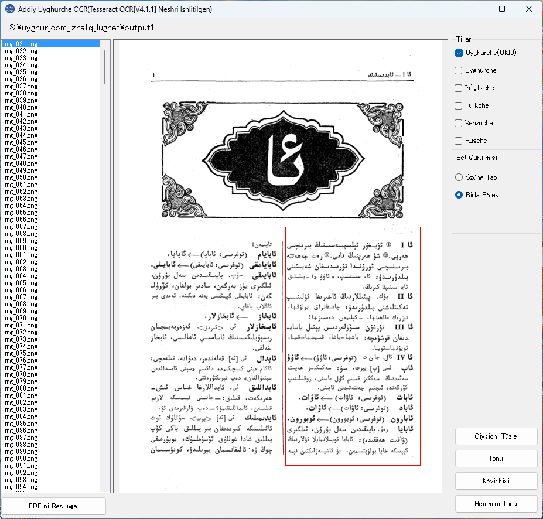

# UyghurOCR
Addiy Uyghurche OCR (Tesseract OCR ishlitilgen)

## Eng yengisini chushurung:
**2.0 neshiri**: https://github.com/gheyret/UyghurOCR/releases/download/2.0/UyghurOCR.zip

# Diqqet
Eger OCR da xataliq körülse, [ Visual Studio 2019 Runtime](https://support.microsoft.com/en-us/topic/the-latest-supported-visual-c-downloads-2647da03-1eea-4433-9aff-95f26a218cc0) ni ornitip sinap béqing. chünki Tesseract OCR bu ambargha béqinidiken.

64 bitliq neshriningla ijra höjjitini yasap qoydum. 32 bitliqni esli kodi asasida özingiz hasil qiling.

**Pikir teleplerni bu yerge yézing: (https://github.com/gheyret/UyghurOCR/issues)**

# Özgirishler(2023/08/31)
Eslidiki Uyghurche modél asasida qaytidin meshiqlendürülüp yéngi modél yasaldi(Uyghurche(UKIJ), ukij.traineddata).

Körünme yüzi özgertildi. (bir nechche tilni birlikte tallighili bolidighan qilindi)

**Chüshürüsh:**
https://github.com/gheyret/UyghurOCR/releases/download/1.5/UyghurOCR.zip

# Özgirishler(2022/08/20)
Barliq körsetme uchurlar ULY(Uyghur Latin Yéziqi) gha özgertildi.

**Chüshürüsh:**

ULY yéziqi neshri(2022/08/20): **https://github.com/gheyret/UyghurOCR/releases/download/uly/UyghurOCR.zip**

# Ékran körünüshiliri

  

  

Konisi:
# Download Zipped Executable from here(Körsetme uchurlar In’glizche):

**1.4 neshiri**: https://github.com/gheyret/UyghurOCR/releases/download/1.4/UyghurOCR.zip

**1.3 neshiri**: https://github.com/gheyret/UyghurOCR/releases/download/1.3/UyghurOCR.zip
